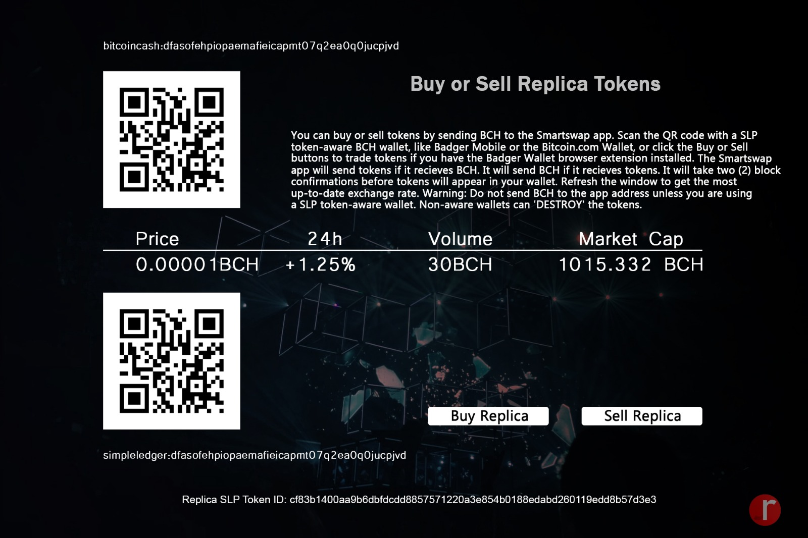

## SmartSwap Development/Liquidity Funding Event #1

|Event Start Date: November 1, 2020|
|Event End Date: December 1, 2020  |
|Funding Target: 50 BCH            | 
|Development Start Date: TBD       |
|Development End Date: TBD         |

***Development estimation time is roughly a few weeks.*** 

## **SmartSwap v.1**: 

SmartSwap will be one of first exclusive stand alone defi based exchanges for the SLP network. We are looking to make this opensource for the community to maintain growth and decentralization. We aspire that token creators will no longer have to relay on centralized exchanges nor other platforms for token facilitation and finance. 

Visual Concept:

## Automated Dividend Calculator/Liquidity Funding Event #1

|Event Start Date: November 1, 2020|
|Event End Date: December 1, 2020  |
|Funding Target: 50 BCH            | 
|Development Start Date: TBD       |
|Development End Date: TBD         |

**Automated Dividend Calculator**

Imagine having the convenience of setting your dividend calculator to distribute dividends on a frequent basis at a certain fixed or variable rate. We are seeking assistance to make sure SLP Token creators can distribute dividends in a more complex manner without breaking a sweat. 

## Liqudity Funding Event #1

|Event Start Date: December 1, 2020|
|Event End Date: January 1, 2021   |          
|Development Date: TBD             |
|Development End Date: TBD         |
|Listing Price: 5x                 |

***The Listing Price will be 5x the market rate is before launch.***

***All remaining funds will be reserved for the SmartSwap app once development has concluded.*** 

To Participate in liquidity funding, please purchase REP from the following exchanges. All proceeds will be used for development and liquidity pool. 

 * [Anycoin.cash](https://www.anycoin.cash/)
   (Supplied 12,500,000.0 REP 10/4/20-10/31/20)
 * [Memo.cash](https://memo.cash/token/cf83b1400aa9b6dbfdcdd8857571220a3e854b0188edabd260119edd8b57d3e3?for-sale)
   (Supplied 12,500,000.0 REP 10/5/20-10/31/20)
   
To track funding progress please view the following link: [Developmnt/Liquidity Event Pool](https://explorer.bitcoin.com/bch/address/bitcoincash:qphpfsfnteu7t0v32tpyr7qdpf6lg5rwtvs3te4zy3)
 
