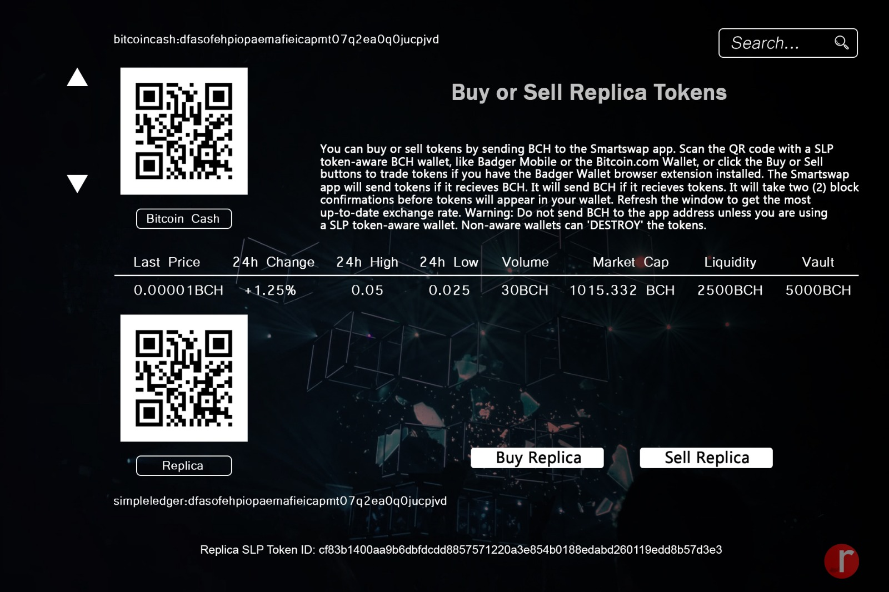

## SLP Swap Protocol Development

The Replica community will be donating time and financial resources continuously for development. 

If you're interested in donating, please donate to the BCH address on the donation page: |[Donate](https://replica-eco.net/mis/demo-post)|
For SLP community updates, join us on telegram: |[Simple Ledger Protocol](https://t.me/simpleledger)|
For SLP development updates, join us on telegram: |[SLP Swap Development](https://t.me/slpost)||[Permissionless Software Foundation](https://t.me/permissionless_software)|
Github Link(s) for SLP Swap: |[SLP Swap](https://github.com/vinarmani/slpswap-client)|

## Replica GPS Forex Token

Late 2021, Replica will create a token directly associated with Forex and MT4. Replica supporters will be able to purchase GPS Forex Tokens and earn monthly yields.
We will provide more information soon.

## SmartSwap Development/(TBD)

|Event Start Date: TBD |
|Event End Date: TBD  |
|Funding Target: TBD   | 
|Development Start Date: TBD       |
|Development End Date: TBD         |

**Project Update(6/18/21)**
The Smartswap project has been delayed due to BCH/SLP development updates. Replica is currently assisting in SLP Swap protocol development.

***Development estimation time is roughly a few weeks.*** 

## **SmartSwap v.2**

SmartSwap will be one of first exclusive stand alone defi based exchanges for the SLP network. We are looking to make this opensource for the community to maintain growth and decentralization. We aspire that token creators will no longer have to rely on centralized exchanges nor other platforms for token facilitation and finance. 

**V.2(Update 12/12/20)**

***Vault***
Experience instant value by storing your cryptocurrency inside of the Smartswap Vault! This feature will help add base value to new SLP tokens permanently! For example, if your SLP token has an available token supply of 50,000, and you deposit $50 in BCH into the vault, your SLP token will have an accumulative value of $50 in BCH. The value of your token will be pegged to the Bitcoin Cash price. 

***Scroll***

Scroll functionality will be added for SmartSwap users that would like to add Bitcoin Cash alternatives.

***Search***

For users with multiple coin/token pairs, a search engine will be integrated. 

***Metric Updates***

24 hour high,24 hour low, vault, and liquidity. 

Visual Concept:

Sample this technology here: [Permissionless Software Foundation](https://psfoundation.cash/)

**The link above is a reference only**

## Automated Dividend Calculator/TBD

|Event Start Date: TBD |
|Event End Date: TBD  |
|Funding Target: TBD   | 
|Development Start Date: TBD       |
|Development End Date: TBD         |

Sample this technology here: [SLP Dividend Calculator](https://tools.bitcoin.com/slp-dividend-calculator/)

**This is a reference only, the app does not contain automation**

**Automated Dividend Calculator**

Imagine having the convenience of setting your dividend calculator to distribute dividends on a frequent basis at a certain fixed or variable rate. We are seeking assistance to make sure SLP Token creators can distribute dividends in a more complex manner without breaking a sweat. 
